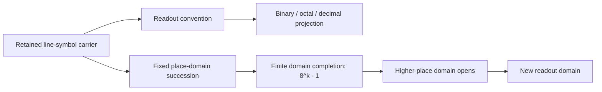
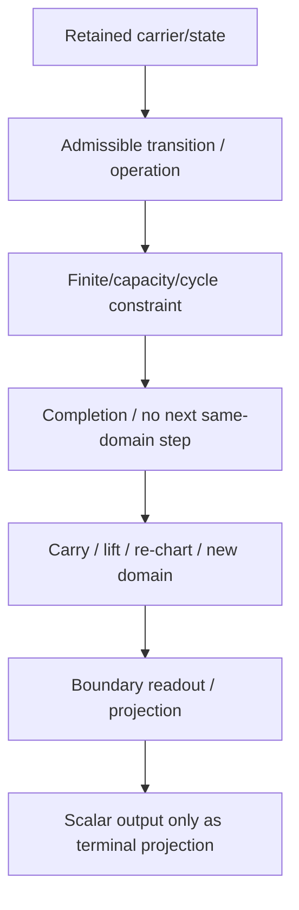

# Orthad / Ancient Yi bridge diagrams

## Corrected Orthad custody/readout

```mermaid
flowchart LR
  X[Retained Xi_hat + word] --> C[Primitive custody: BQ ticks]
  C --> D[(BQ)^6 domain completion]
  D --> L[L host lift: carry q/theta, rank +1]
  L --> X2[New active axis/domain]
  L --> O[Orthad boundary readout]
  O --> S[Terminal scalar/external comparison only]
```

## Ancient Yi carrier/readout/carry bridge



## Normalized operational stack


