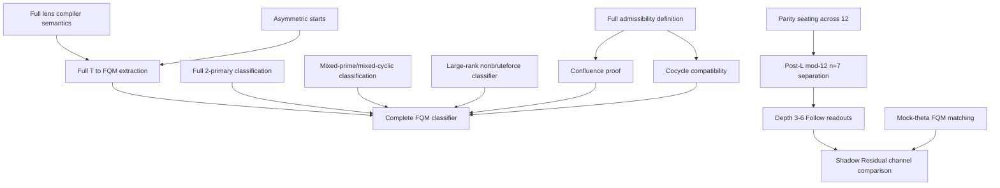

# Closure Dependency Graph

```mermaid
graph TD
  T02[Full admissibility definition] --> T04[Confluence proof]
  T02 --> T05[Cocycle compatibility]
  T06[Full lens compiler semantics] --> T07[Full T to FQM extraction]
  T07 --> T08[Complete FQM classifier]
  T09[Full 2-primary classification] --> T08
  T10[Mixed-prime/mixed-cyclic classification] --> T08
  T11[Large-rank nonbruteforce classifier] --> T08
  T12[Parity seating across 12] --> T13[Post-L mod-12 n=7 separation]
  T13 --> T14[Depth 3-6 Follow readouts]
  T14 --> T18[Shadow Residual channel comparison]
  T16[Asymmetric starts] --> T07
  T17[Mock-theta FQM matching] --> T18
  T04 --> T08
  T05 --> T08
```
